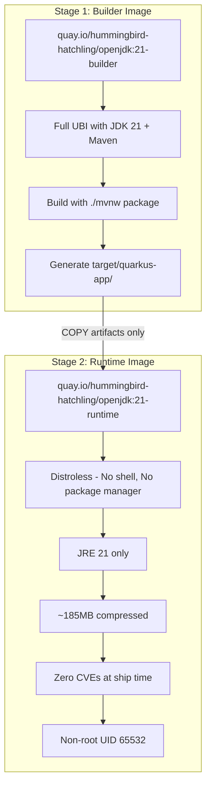
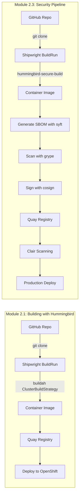

# Sample Quarkus Application with Project Hummingbird

[](https://github.com/tosin2013/sample-quarkus-hummingbird/actions/workflows/ci.yml)
[](https://quarkus.io/)
[](https://openjdk.org/projects/jdk/21/)
[](https://github.com/tosin2013/zero-cve-hummingbird-showroom)

A minimal Quarkus REST application demonstrating secure container image builds with **Project Hummingbird**—Red Hat's initiative to deliver zero-CVE, distroless container base images.

This repository is used in the [Zero CVE Hummingbird Workshop](https://github.com/tosin2013/zero-cve-hummingbird-showroom) (Modules 2.1 and 2.3) to demonstrate building production-ready container images on OpenShift using Shipwright.

## What is Project Hummingbird?

Project Hummingbird is Red Hat's initiative to deliver **zero-CVE container base images** built from Fedora. Key features:

- **Zero CVEs at ship time** with embedded SBOMs (Software Bill of Materials)
- **Distroless design** - No shell, no package manager, minimal attack surface
- **Micro-sized** - JRE runtime ~185MB compressed vs 400MB+ traditional UBI
- **Content-based layers** - 33 layers using chunkah for optimal caching
- **Non-root execution** - Runs as UID 65532 by default
- **Security-first** - Built for cloud-native workloads with minimal dependencies

## Multi-Stage Build Architecture

This application uses a multi-stage Containerfile pattern to separate build and runtime environments:



**Benefits:**
- Build tools (Maven, JDK) stay in builder stage - never shipped to production
- Runtime image contains only JRE + application artifacts
- Minimal attack surface with distroless runtime
- Reproducible builds with content-based layering

## Workshop Integration

This repository is the demo application for the Zero CVE Hummingbird Workshop, showing how to build secure container images on OpenShift:



### Module 2.1: Building with Hummingbird
Students learn to:
- Clone this repository as a build source
- Create Shipwright BuildRun with `buildah` ClusterBuildStrategy
- Build multi-stage Containerfile using Hummingbird images
- Push to Quay registry and deploy to OpenShift

### Module 2.3: Security Pipeline & Production
Students enhance the pipeline with:
- `hummingbird-secure-build` ClusterBuildStrategy
- SBOM generation with Syft (SPDX format)
- Vulnerability scanning with Grype
- Image signing with Cosign
- Registry scanning with Clair

## Quick Start

### Prerequisites
- Java 21 or later
- Maven 3.8+ (or use included `./mvnw` wrapper)
- Podman or Docker for container builds

### Build and Run Locally

```bash
# Clone the repository
git clone https://github.com/tosin2013/sample-quarkus-hummingbird.git
cd sample-quarkus-hummingbird

# Build with Maven
./mvnw clean package -DskipTests

# Run the application
java -jar target/quarkus-app/quarkus-run.jar

# Test endpoints
curl http://localhost:8080/hello
curl http://localhost:8080/q/health
```

### Build Container Image

```bash
# Build with Podman
podman build -t sample-quarkus-hummingbird:latest .

# Run container
podman run -p 8080:8080 sample-quarkus-hummingbird:latest

# Test endpoints
curl http://localhost:8080/hello
```

### Build with Docker

```bash
# Build with Docker
docker build -t sample-quarkus-hummingbird:latest .

# Run container
docker run -p 8080:8080 sample-quarkus-hummingbird:latest
```

## API Documentation

### `GET /hello`
Returns a JSON greeting with runtime information.

**Response:**
```json
{
  "message": "Hello from Hummingbird!",
  "runtime": "Quarkus + JDK 21.0.10"
}
```

### Health Endpoints

Provided by Quarkus SmallRye Health extension:

- `GET /q/health` - Combined health check
- `GET /q/health/live` - Liveness probe (is the app running?)
- `GET /q/health/ready` - Readiness probe (is the app ready to serve traffic?)

**Example:**
```bash
curl http://localhost:8080/q/health
```

**Response:**
```json
{
  "status": "UP",
  "checks": []
}
```

## Architecture Details

### Technology Stack
- **Framework**: Quarkus 3.17.8 (Supersonic Subatomic Java)
- **Language**: Java 21
- **Build Tool**: Maven 3.9.9
- **Container Runtime**: Podman/Docker
- **Base Images**:
  - Builder: `quay.io/hummingbird-hatchling/openjdk:21-builder`
  - Runtime: `quay.io/hummingbird-hatchling/openjdk:21-runtime`

### Quarkus Extensions
- `quarkus-rest` - RESTEasy Reactive for REST endpoints
- `quarkus-rest-jackson` - JSON serialization with Jackson
- `quarkus-smallrye-health` - Health check endpoints
- `quarkus-arc` - CDI dependency injection

### Security Features

**Multi-Stage Build Pattern:**
- Build dependencies (Maven, JDK) isolated in builder stage
- Runtime image contains only JRE + application artifacts
- No build tools or source code in final image

**Hummingbird Runtime Benefits:**
- **Distroless**: No shell (`/bin/sh`), no package manager (`dnf`, `yum`)
- **Non-root**: Runs as UID 65532 (unprivileged user)
- **Minimal**: Only JRE and application dependencies
- **Secure**: Zero CVEs at release time
- **Traceable**: Embedded SBOM for supply chain security

**Image Size Comparison:**
- Traditional UBI-based JRE: ~400MB compressed
- Hummingbird JRE runtime: ~185MB compressed
- **54% smaller**, less network transfer, faster deployments

## Workshop Resources

- **Workshop Repository**: [zero-cve-hummingbird-showroom](https://github.com/tosin2013/zero-cve-hummingbird-showroom)
- **Module 2.1**: Building with Hummingbird on OpenShift (Shipwright + Buildah)
- **Module 2.3**: Security Pipeline & Production (SBOM, Scanning, Signing)
- **Hummingbird Images**: [quay.io/hummingbird-hatchling](https://quay.io/organization/hummingbird-hatchling)

## CI/CD

This repository includes GitHub Actions workflows to keep the application up to date and healthy:

- **Continuous Integration**: Build and test on every push/PR
- **Container Validation**: Verify multi-stage builds produce correct images
- **Security Scanning**: Generate SBOM and scan for vulnerabilities with Syft/Grype
- **Dependency Updates**: Automated Dependabot PRs for Maven dependencies and GitHub Actions
- **Scheduled Builds**: Weekly validation on Monday mornings

See [`.github/workflows/ci.yml`](.github/workflows/ci.yml) and [`.github/dependabot.yml`](.github/dependabot.yml) for details.

## Development

### Project Structure
```
sample-quarkus-hummingbird/
├── src/
│   └── main/
│       ├── java/com/example/
│       │   └── GreetingResource.java    # REST endpoint
│       └── resources/
│           └── application.properties    # Quarkus configuration
├── Containerfile                         # Multi-stage build definition
├── pom.xml                               # Maven dependencies
├── mvnw / mvnw.cmd                       # Maven wrapper
└── .github/
    ├── workflows/ci.yml                  # GitHub Actions CI
    └── dependabot.yml                    # Dependency automation
```

### Running Tests

```bash
# Run all tests
./mvnw test

# Run tests in dev mode with live reload
./mvnw quarkus:dev
```

### Development Mode

Quarkus offers a dev mode with live reload:

```bash
./mvnw quarkus:dev
```

Then make changes to your code - they'll be automatically recompiled and reloaded!

## Contributing

This is a workshop demonstration repository. For issues or suggestions:

1. Open an issue in this repository
2. For workshop content issues, see [zero-cve-hummingbird-showroom](https://github.com/tosin2013/zero-cve-hummingbird-showroom)

## License

This project is provided as-is for educational purposes as part of the Zero CVE Hummingbird Workshop.

## Author

**Tosin Akinosho**
Email: takinosh@redhat.com
GitHub: [@tosin2013](https://github.com/tosin2013)

---

**Learn more:**
- [Quarkus Documentation](https://quarkus.io)
- [Project Hummingbird](https://quay.io/organization/hummingbird-hatchling)
- [Shipwright Build Framework](https://shipwright.io)
